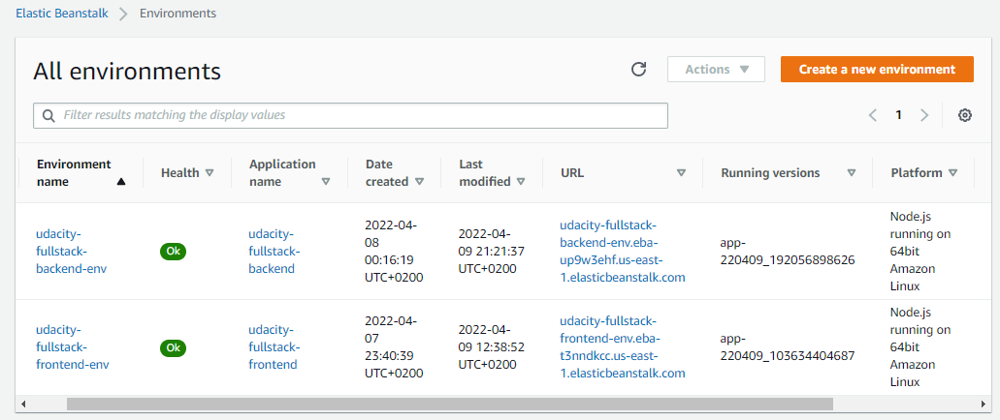
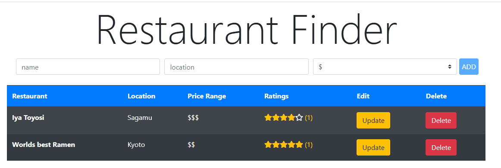
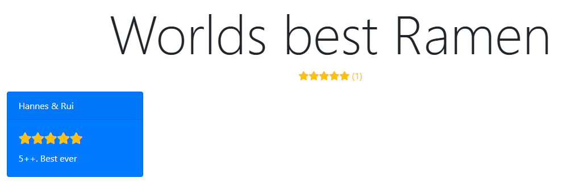
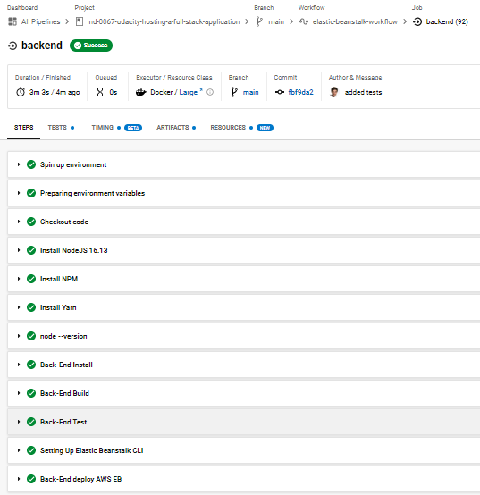
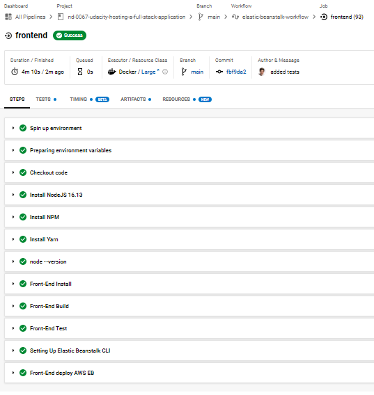

# Description
## Project
This Fullstack Application was made for the Udacity Project "Hosting a Full-Stack Application".

It consists of a REACT frontend (nodejs) and an Express backend (nodejs).

Codebase of both Apps is from the tutorial [Deploy PERN Fullstack App on Heroku and Netlify (Automatic Deploy)](https://levelup.gitconnected.com/deploy-pern-fullstack-app-on-heroku-and-netlify-automatic-deploy-9b61ac6a254e) on Medium.
Instead of Heraklion I used AWS Elastic Beanstalk in combination with CircleCI as the CI/CD Plattform.
Also dummy tests were inserted as Proof of concept for the CICD Pipeline

## Links
Backend: [Link](http://udacity-fullstack-backend-env.eba-up9w3ehf.us-east-1.elasticbeanstalk.com/api/v1/restaurants)

Frontend: [Link](http://udacity-fullstack-frontend-env.eba-t3nndkcc.us-east-1.elasticbeanstalk.com/`)

## AWS / DB
As Deployment Platform AWS Elastic Beanstalk (EB) is used. Frontend and Backend each have 1 Environment on EB.
As Database for the persistant data Postgres is used. For convinience the DB is created under the backend environment.

## How to use the WebApp
It consits of the two pages: Restaurant List (home) and Review

### Restaurants List

Overview of Restaurants with Name | Location | Price Range | Ratings.
The user cann update, delete or add new restaurants to the list.
### Restaurant-Review

For Each Restaurant the user can see all the ratings for the specific restaurants.

## CI/CD Circle-CI
CircleCi workflow is triggered on new commits on this repo.
The configuration is stored under `circleci\config.yml`

Successful Backend Pipeline

Successful Frontend Pipeline
