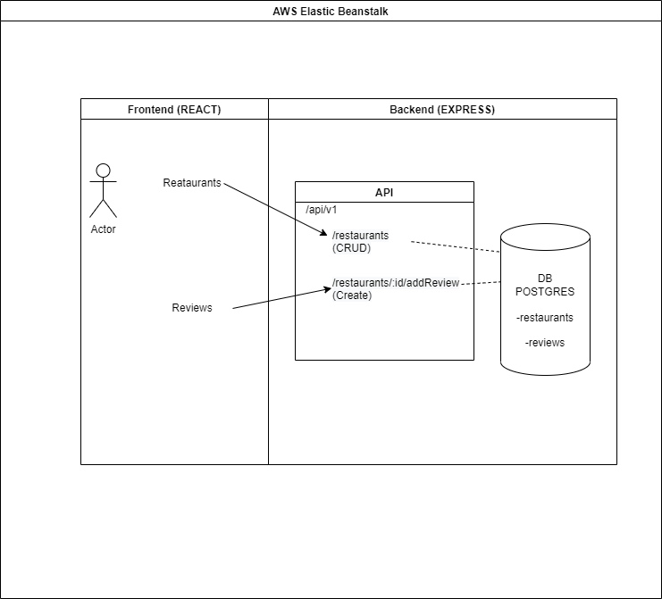

# CI/CD Circle-CI
CircleCi workflow is triggered on new commits on this repo (main branch).
The configuration is stored under `circleci\config.yml`

## Process-Flow
The Build and Deployment is automated using CircleCi. See the following process flow:

# Architecture
Two environments frontend/backend are deployed on AWS Elastic Beanstalk. Files are stored on AWS S3 and persistent Data is stored in a Postgres DB.
Each App is hosted in an AWS Instance. See Architecture:

