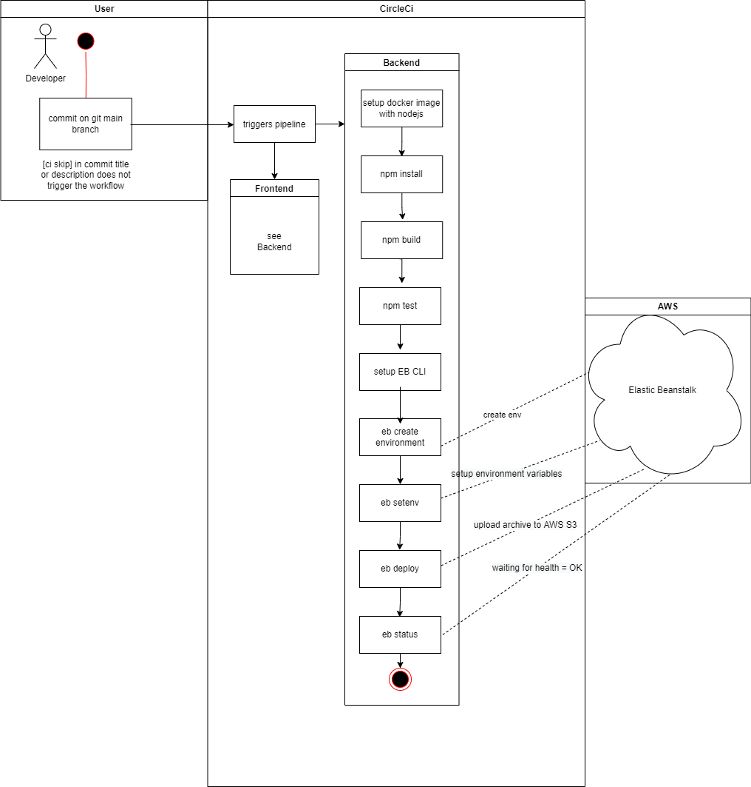

# CI/CD Circle-CI
CircleCi workflow is triggered on new commits on this repo (main branch). After the commit, the frontend and backend share a similar workflow:
1. Install App
2. Build App
3. Test App
4. Deploy App to Elastic Beanstalk
for detailed information see Process Flow below
   
The configuration is stored under `circleci\config.yml`

## Process
The Build and Deployment is automated using CircleCi. See the following process flow:

## Continuous Integration
### GitHub
The developers commit and push their code to the GitHub repository which is linked to the CircleCI platform. GitHub triggers the CircleCI platform when code is pushed to the repository.

### CircleCI
.circleci/config.yml file defines what has to be done on CircleCI. In this Fullstack Application, there are 2 jobs (frontend & server) to be run by CircleCI.